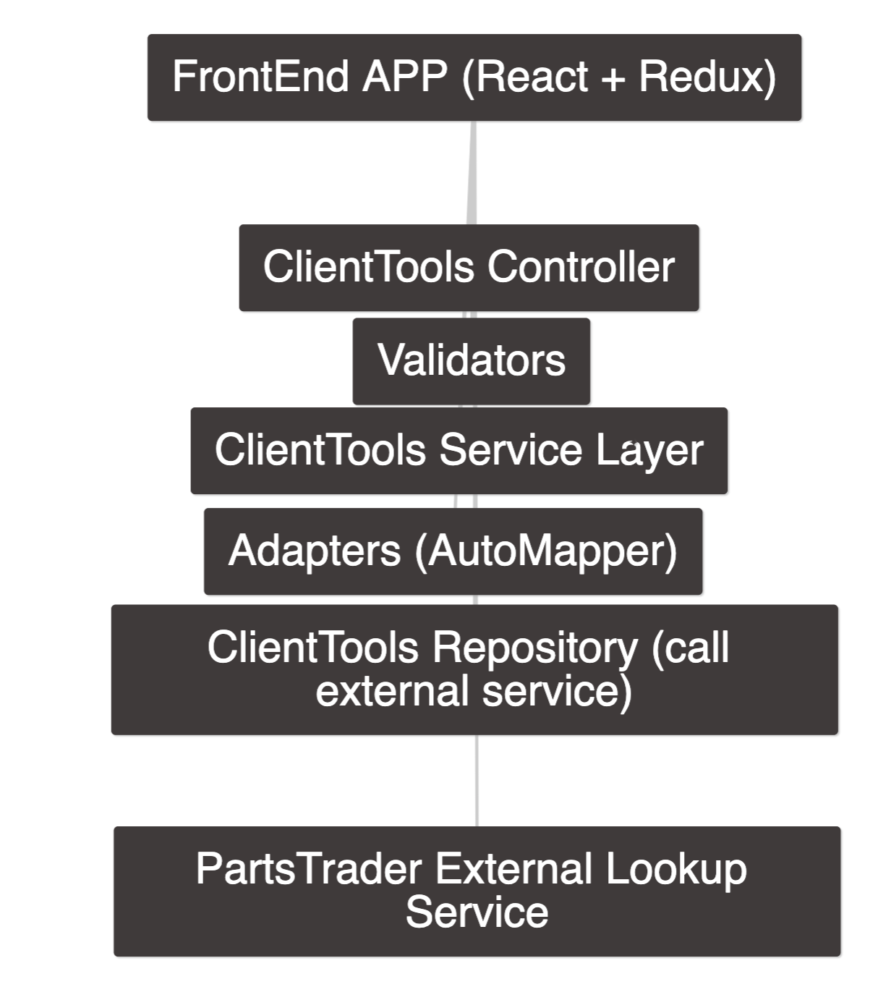

# ClientTools__backend

This project consists of the server side API for the ClientTools application. To run the solution, make sure you have .NET Core SDK 2.1 or higher. 

Download the source and run: 

`dotnet --project ./PartsTrader.ClientTools.API run`

For a better development experience use instead: 

`dotnet watch --project PartsTrader.ClientTools.API run`

The test suite can be run with the command: 

`dotnet test`

### The solution

This application serves the ClientTools frontend webapp. The clients can utilize ClientTools' simple UI to lookup for parts in the central catalogue. The catalogue service was mocked for testing purposes.


#### Logging

`NLog` third party dependency was used to handle logging to files.

#### Validations

`DataAnnotations` were not used in this app. Instead, custom validators were implemented to facilitate unit testing and preserve the nature of POCOs as model classes. `Fluent Validation` was considered, but for the sake of the project it would be overkill.

#### Service layer

The service layer is responsible for validating business rules and transforms data between the repositories and controllers. `AutoMapper` is being injected to take care of object mapping.

#### Repository 

The repositories fake calls to external parts lookup service. The methods are in reality reading json files in the root of the project, just to speedup the implementation.

#### TDD

Status of the testing suites:
```
Controllers - OK
Repositories - OK
Services - OK
Validators - OK
```

The app was developed using TDD. MSTests is the tesling library of choice. `Moq` was used to create mocked implementations of interfaces.

#### Documentation

`Swagger` was used to document the API for consumers. 
